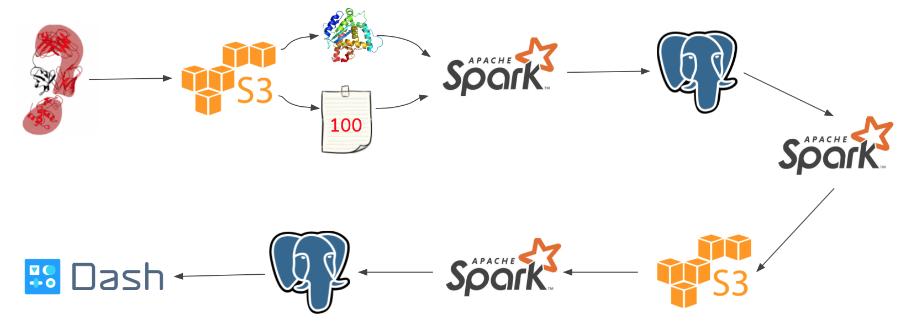

# Purpose

A good method for evaluating simulated protein structures is important considering the following two facts.

- Studing the structures of target proteins can help understand the proteins' functions and thus benefits many fields such as drug design
- Simulated structures can be studied as models of the target protein, given its experiemental structure is highly cost. While one can produce many simulated structures at one time, a good evaluation method can priorize the good candidates and thus save resource

Recent years, machine learning is applied widely for regression and classification, where it shows potential of being a new method for evaluating simulated protein structures. However, in order to achieve that, one needs to collect enough data as training set and extracting interseting features. With the colloected data and features, people in this field would be able to explore new evaluation methods which are based on machine learning.

Due to the above reasons, I launched this project. The project consists of two sections. In the first section, the project builds a database for 225,271 simulated protein structure models.  Simulated candidate IDs, extracted features(weighted contact map) and GDT_TS scores are stored in the database, which is ready for the further machine-learning-based exploration.

In the second section, I explored a possible machine-learning-based evaluation method. In more details, I transferred the contact map of simulated structures into images and applied InceptionV3 to classify the candidates.

The simulated structures in the database is from CASP8—CASP13. Training set for the second section is from CASP8 and simulated structures for several target proteins from CASP13 works as test data. (Critical Assessment of protein Structure Prediction, or CASP, is a community-wide, worldwide experiment for protein structure prediction taking place every two years since 1994. CASP provides research groups with an opportunity to objectively test their structure prediction methods and delivers an independent assessment of the state of the art in protein structure modeling to the research community and software users. — From Wikipedia) 

# Directory structures

```shell
protein_structure_model_evaluation
|_DE
|  |_etl
|     |_etlprotein.py
|     |_run.sh
|     |_candidate.sql
|     |_LIC
|_DS
|  |_imageTransfer
|  |  |_bi2pic.py
|  |  |_postgresql-42.4.8.jar
|  |  |_run.sh
|  |_plot
|  |  |_plots.py
|  |_cnn
|     |_train_model.py
|     |_test_model.py
|     |_run.sh
|     |_prediction.sql
|
|_front_end
   |_app.py
```

- etlprotein.py: extract the CASP8--13 data of structures and scores from S#, transfer the structure information into contact map(structure features), load the matched structure IDs, structure features and scores into PostgreSQL
- bi2pic.py: transfer the contact maps(matrices) into images and upload the images into S3
- plots.py: plot the scores' count distruction for CASP8 structures, in order to divide structures into buckets according to their scores
- train_model.py: train the CASP8 data
- test_model.py: test simulated structures for several target proteins in CASP13
- LIC: a binary file which is used for extracting features, i.e. computing the weighted contact maps

# Data Pipeline

 

# Demo

http://www.datapartner.me